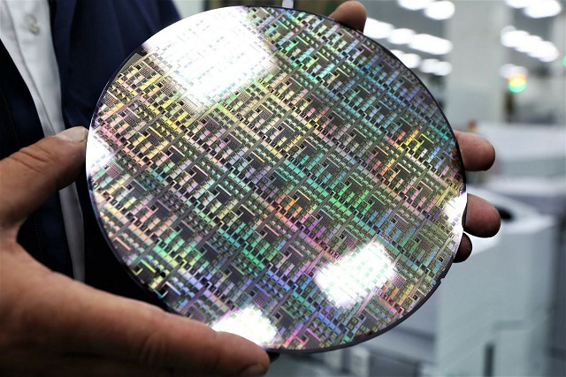

#This is a script that controls the movement of the laser burning through the jumpers of the chips on the crystal
***

Example of a chip crystal:

The principle of the script: the file "Crystal" is read Coordinates.txt ", which indicates the coordinates of all the crystals that need to be processed and the jumpers that need to be burned. An example of such a file[^1]:
>0&emsp;&emsp;0&emsp;&emsp;F1F2F3
0&emsp;&emsp;300&emsp;&emsp;F1F3
0&emsp;&emsp;600&emsp;&emsp;F2F3
0&emsp;&emsp;900&emsp;&emsp;F1
0&emsp;&emsp;1200&emsp;&emsp;F2
1000&emsp;&emsp;0&emsp;&emsp;-
1000&emsp;&emsp;300&emsp;&emsp;F2
1000&emsp;&emsp;600&emsp;&emsp;F2F3
1000&emsp;&emsp;900&emsp;&emsp;F3
1000&emsp;&emsp;1200&emsp;&emsp;F2F3
2000&emsp;&emsp;0&emsp;&emsp;F1
2000&emsp;&emsp;300&emsp;&emsp;-
2000&emsp;&emsp;600&emsp;&emsp;-
2000&emsp;&emsp;900&emsp;&emsp;F1F3
2000&emsp;&emsp;1200&emsp;&emsp;F3

The program goes to the coordinates of the first crystal and starts bypassing 3 rows of jumpers with a "snake" and, if necessary (if there are inscriptions F1, F2 or F3 for the first, second and third respectively) burns them out. At the end of the column, the script automatically adjusts vertically (Z axis) for 10 seconds, after which the laser switches to a new column.

text1 &emsp; text2

[^1]: after filling in each cell, press TAB to read the file correctly by the script